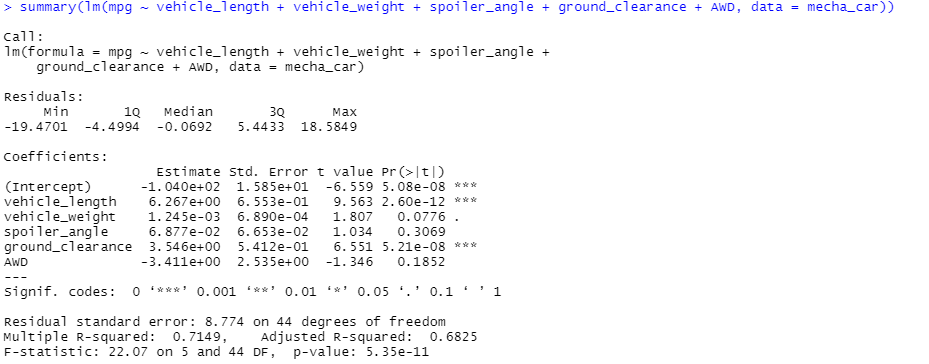
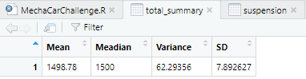
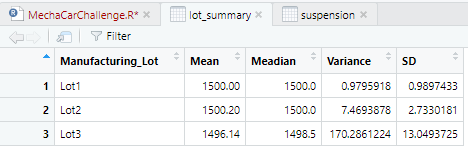
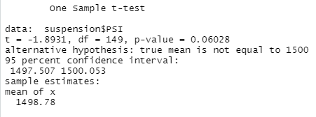
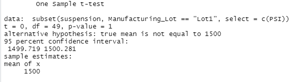
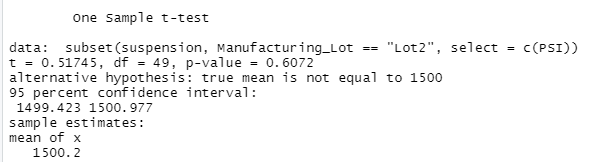
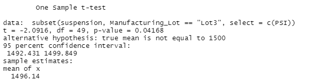

# MechaCar_Statistical_Analysis
## Linear Regression to Predict MPG
In this, we looked at several different factors and how closely trends in those factors match trends in MPG, namely: Vehicle Length, Vehicle Weight, Spoiler Angle, Ground Clearance, and AWD. To do this, a multiple linear regression was performed. This is the outcome:

There's a lot to parse through, but the important numbers are in the `Pr(>|t|)` column, or otherwise known as our P-value. The smaller that number, the more likely changes in that factor are associated with changes in MPG. When looking at that, two factors stand out: Ground Clearance and Vehicle Length. Those two factors in our model show that the slope of the linear regression is not zero. Or, said another way, these two factors are correlated with MPG.

The final question is how effective the model is at predicting MPG. To get that answered, we look at another number, `Multiple R-Squared`, which is 0.7149. Translated, this means that when taking into account all the factors, this model can predict MPG of future cars with about 71.5% accuracy, a useful but infallible percentage. Does this make it effective? Depending on what the model was needed for, it could be either effective or ineffective. Intuitively, Vehicle Length and Ground Clearance aren't particulary descriptive, but their close relationship with MPG suggests that another factor not used in this model could make the predictive power even stronger. My recommendation would be to search for another correlated vehicle factor to make the model more predictive.
## Summary Statistics on Suspension Coils
This section looked at variance in suspension coils both in the whole population and at three lots individually. As design specifications for the coils dictate that the variance in the coils may not exceed 100 PSI, its important to locate faulty coils. The first analysis was on the whole lot:

Across the whole population, the variance in the coils is around 62 PSI, below design specs but a worryingly large number. A closer examination of the maunfacturing lots may reveal if there are faulty coils being sent out. Here is the lot summary:

Both lot 1 and lot 2 have very low variances (less than 10 PSI for both), but lot 3 has a dangerous variance of 170 PSI, which is far beyond design specs. The plant responsible for manufacturing lot 3 should be looked at and fixed.
## T-Tests on Suspension Coils
The purpose of the t-test is to compare the means of different populations and determine if they are similar. First we look at the whole population and see if its mean is similar to the goal mean of 1500 PSI:

The important number to look at here is `p-value` which is 0.06. Since this p-value is not below 0.05 (though it is really close!) we can say that our total population has the same mean as the goal. It would be valuable to look at the individual lots to see if our faulty lot, lot 3, is affecting our results here. Here are the individual lot summaries:

Lot 1:

Lot 2:

Lot 3:

The first two lots have p-values much greater than 0.05 (1 and 0.61 respectively), but our troublesome lot 3 has a p-value of 0.04. This leads to the conclusion that lot 3's mean is not equal to 1500 PSI.
## Study Design: MechaCar vs Competition
We want to show how MechaCar is superior to the competition, and a great way to do that is with different statistical analyses. Consumers want to know that the cars they're getting are great values with better fuel efficiency, better safety ratings, even more horsepower than the competition. A good statistical analysis could look at other vehicles in MechaCar's price range and use the T-Test to see how the competiton compares on each metric. Written another way, we can try to reject our null hypothesis, that each factor is similar in each car, accept our alternative hypothesis, that the MechaCar outperforms the competition in these factors, and show that the MechaCar is the superior car at its value.

Other facctors to consider would be maintenance cost, acceleration speed, or even examining what percentage of cars stay on the road 10 years after purchase. These would all best be addressed with t-tests.